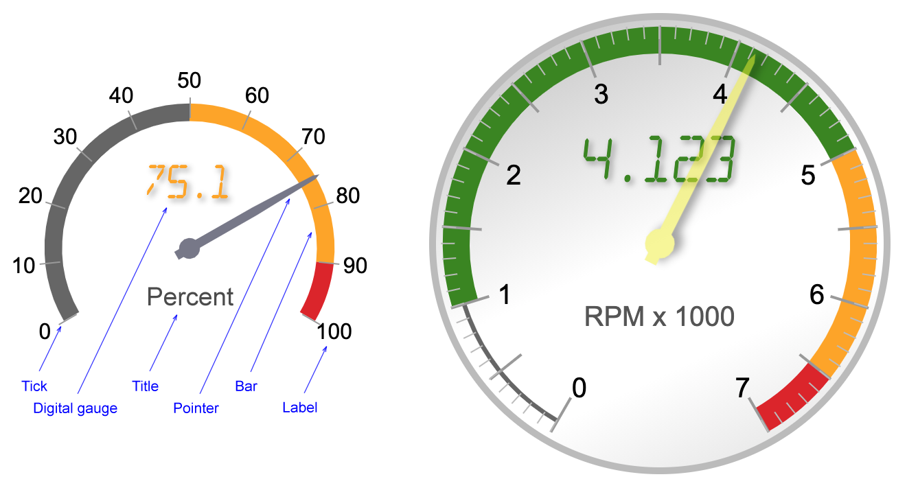

# jquery.simplegauge v1.0.0

[](https://github.com/peterthoeny/jquery.simplegauge/issues)
[](https://github.com/peterthoeny/jquery.simplegauge/stargazers)
[](https://github.com/peterthoeny/jquery.simplegauge/blob/master/LICENSE)

jquery.simplegauge is a simple jQuery plugin to show an analog and/or digital gauge.



## Getting Started

```
<link href="/path/to/jquery.simplegauge/jquery.simplegauge.css" type="text/css" rel="stylesheet">
<script src="https://code.jquery.com/jquery-latest.js" type="text/javascript" charset="utf-8"></script>
<script src="/path/to/jquery.simplegauge/jquery.simplegauge.js" type="text/javascript" charset="utf-8"></script>

<div id="demoGauge"></div>

<script>
$(document).ready(function() {
  var gaugeOptions = {
    min: 0,
    max: 100,
    value: 65
  };
  $('#demoGauge').simpleGauge(gaugeOptions);
});
</script>
```

## Set and Get Value

Once a gauge has been initialized you can get and set the value:

```
<script>
$(document).ready(function() {
  var gaugeOptions = { value: 65 };
  $('#demoGauge').simpleGauge({ value: 65 });         // initialize with 65
  $('#demoGauge').simpleGauge('setValue', 33);        // set value to 33
  let val = $('#demoGauge').simpleGauge('getValue');  // returns 33
});
</script>
```

## Configuration

To configure a gauge, pass an object with options to `.simpleGauge()`:

```
$('#demoGauge').simpleGauge({
  value:  4.1,                  // initial value, default: 0
  min:    0,                    // minimum value, default: 0
  max:    7,                    // vaximum value, default: 100

  type:   'analog digital',     // enable one or more gauges, default: 'analog digital'
  container: {
    scale:  95,                 // scale of gauge in percent, default: 100
    style:  'background: #ddd;' // container style, default: 'font-family: Arial, sans-serif;'
  },
  title: {                      // gauge title:
    text:   '',                 // title text of gauge, default: ''
    style:  'color: #555;'      // style of title, default: 'top: 60%; font-size: 26px;'
  },
  digital: {                    // digital gauge:
    text:   '{value.3}',        // value, with number of decimals, default: '{value.1}'
    style:  'color: auto;'      // style, default: 'color: auto; top: 25%; font-size: 25px;'
                                // 'color: auto;' will set the color based on the value
  },
  analog: {                     // anaglog gauge:
    minAngle:   -150,           // minimum angle in degrees, default: -120
    maxAngle:   150             // maximum angle in degrees, default: 120
  },
  labels: {                     // gauge labels:
    text:   '{value}',          // text format of value, default: '{value}'
    count:  7,                  // number of labels, default: 10
    scale:  73,                 // scale in percent, default: 95
    style:  'font-size: 20px;'  // style, default: ''
  },
  ticks: {                      // ticks (markers)
    count:  14,                 // number of ticks. 0 for none, default: 10
    scale1: 84,                 // inner scale, default: 77
    scale2: 93,                 // outer scale, default: 83
    style:  'width: 2px;'       // style, default: ''
  },
  subTicks: {                   // sub-ticks, between ticks
    count:  5,                  // number of sub-ticks, 0 for none, default: 0
    scale1: 93,                 // inner scale, default: 80
    scale2: 96,                 // outer scale, default: 83
    style:  'color: #bbb;'      // style, default: ''
  },
  bars: {                       // gauge bars (color bands)
    scale1: 88,                 // inner scale, default: 75
    scale2: 94,                 // outer scale, default: 80
    style:  '',                 // style, default: ''
    colors: [                   // color bands, array of arrays:
      [ 0,   '#666', 91, 92 ],  // innter array items:
      [ 1.0, '#378618', 0, 0 ], //   [0] start value,
      [ 5.0, '#ffa500', 0, 0 ], //   [1] bar color,
      [ 6.5, '#dd2222', 0, 0 ]  //   [2] inner scale (0 to inherit),
    ]                           //   [3] outer scale (0 to inherit)
  },
  pointer: {                    // pointer (gauge digit)
    scale: 95,                  // scale in percent, default: 85
    shape: '2,100 -2,100 ...',  // custom shape, string with coordinates (see notes)
    style: 'color: #ee0;'       // style, default: 'color: #778'
  }
});
```

Note: The `pointer.shape` option defines the shape of the pointer in the form of space separated `x,y` coordinates. Coordinate `0,0` is the center of the gauge, `0,100` is tip of the pointer. The first and last coordinate should match. Default shape:

`shape: '-3,-10 3,-10 3,-6.3 5,-5 6.3,-3 7,0 6.3,3 5,5 3,6.3 3,50 1.5,96 0,100 -1.5,96 -3,50 -3,6.3 -5,5 -6.3,3 -7,0 -6.3,-3 -5,-5 -3,-6.3 -3,-10'`

## Demo

See [demo.html](https://peterthoeny.github.io/jquery.simplegauge/demo.html)

// EOF
